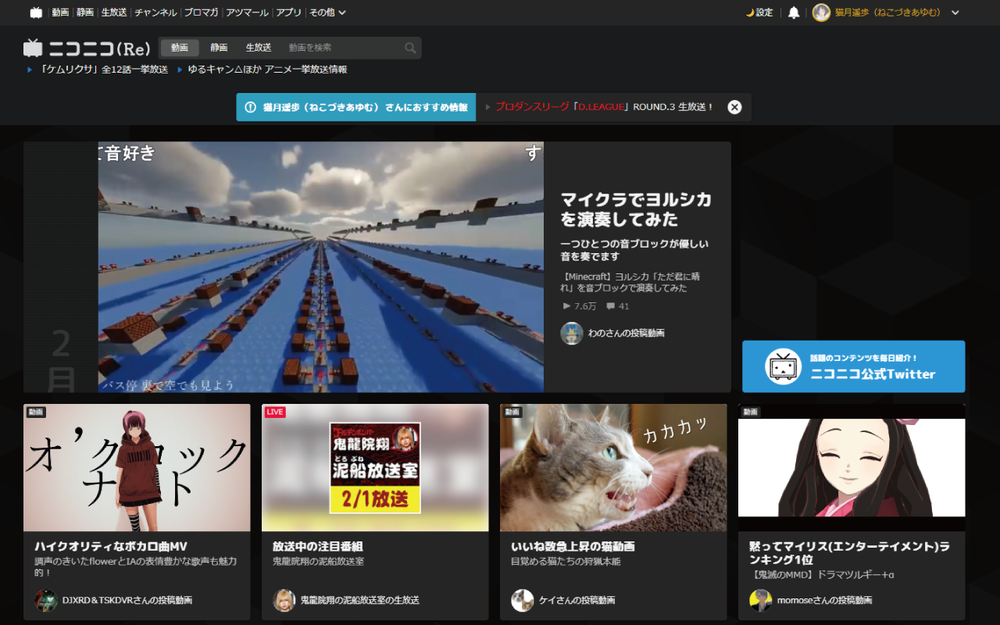

 

   


ニコニコサイトをダークモード化する拡張機能です。

▼ DLはこちらから
- [Chrome Web Store](https://chrome.google.com/webstore/detail/niconico-darkmode/gihjpgjpgofigjcckobchfchlfbhenjl)
- [Firefox Add-ons](https://addons.mozilla.org/ja/firefox/addon/niconico-darkmode/)
- [Edgeアドオン](https://microsoftedge.microsoft.com/addons/detail/niconico-darkmode/gblbengmjlopiihejjfimdcbcgmiccad)

## Preview



---

## 必要条件
以下のいずれかを利用して開発に参加することができます。
- Google Chrome 最新版
- Mozilla Firefox 最新版
- DockerとDocker-compose実行環境

（どれもOSは問わないが最新のものであることが条件）

## 使用言語 / 技術
- SCSS
- CSS3
- javascript
- jQuery
- Docker / Docker-compose（ソースファイルのコンパイルに必要）

## ディレクトリ構成
```sh
$ tree -L 3
.
├── LICENSE
├── README.md
├── docker-compose.yml
├── etc #プロジェクトに関連する設定の格納先
│   └── compile #compileコンテナ関連
│       ├── Dockerfile
│       ├── gulpfile.js #gulp.jsの設定ファイル。レシピの追記があればここに
│       └── package.json #node.jsの設定ファイル。パッケージの追加があればここに。
├── lib #GitHubで利用する画像などの格納先
│   └── ss
├── memo.md
└── src #ソースファイルの格納先
    ├── images #画像
    ├── js #スクリプト
    ├── manifest.json #拡張機能の定義ファイル
    └── style_for #各ニコニコページ向けのスタイルシート
        ├── account
        ├── live
        ├── parts
        ├── top
        └── video
```

## 開発への参加
開発への参加は、GitHubWikiも同時に参照してください。
https://github.com/AyumuNekozuki/niconico-darkmode/wiki

### 環境構築(Chrome)
1. 最新のリポジトリをDL
2. dockerとdocker-composeの実行環境を用意
3. [拡張機能の管理](chrome://extensions/)からデベロッパーモードを有効化
4. gitのルートディレクトリで`docker compose up`を実行しコンパイルを実行
5. `dest`を読み込み編集
6. 終了させる場合は、`docker compose down`

### 環境構築(Firefox)
1. 最新のリポジトリをDL
2. dockerとdocker-composeの実行環境を用意
3. [デバッグメニュー](about:debugging#/runtime/this-firefox)へ移動
4. gitのルートディレクトリで`docker compose up`を実行しコンパイルを実行
5. `dest`を読み込み編集
6. 終了させる場合は、`docker compose down`

### 注意事項
同じファイルでChrome/Firefoxどちらも動作する必要があります。

## ライセンス
MIT

## 作者
AyumuNekozuki / [@nekozuki_dev](https://twitter.com/nekozuki_dev) 

## Contributors
[@hiyakake](https://github.com/hiyakake) 
[@tearaikazuki](https://github.com/tearaikazuki) 
[@istallia](https://github.com/istallia) 

